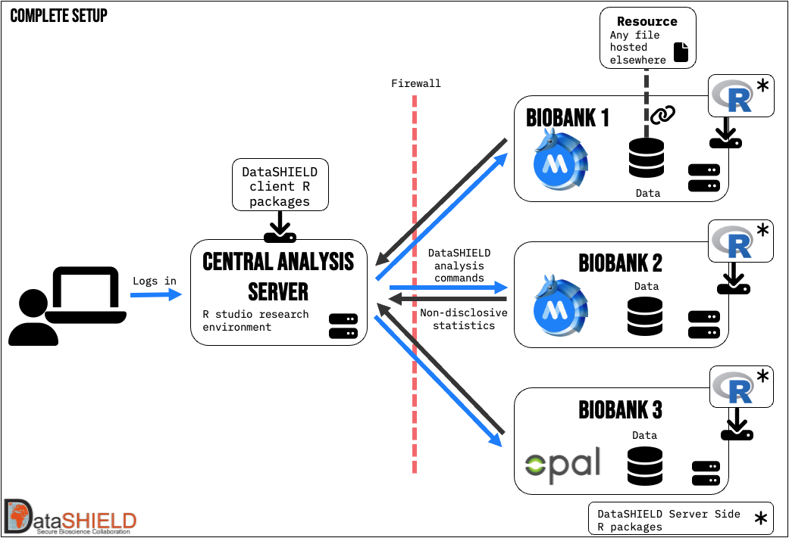

# Armadillo suite

<!--  -->
<!--  -->

<!--  -->

# Overview

Use MOLGENIS Armadillo to make data available for privacy protecting federated analysis using [DataSHIELD](https://datashield.org) protocol. Armadillo
service provides the following features:
* **manage data projects**. Projects can either hold tabular data in the efficient 'parquet' format or any other file use DataSHIELD
  'resources' framework.
* **grant users access permission**. We use a central OIDC service like KeyCloak or FusionAuth in combination with a trused identity provider like
  Life Sciences AAI to authenticate users.
* **configure DataSHIELD analysis profiles**. [DataSHIELD analysis profiles](https://www.datashield.org/help/standard-profiles-and-plaforms) are
  Docker images that contain a collection of multiple [DataSHIELD analysis packages](https://www.datashield.org/help/community-packages).

## Getting started

For installing and using Armadillo see our 
[Documentation](https://molgenis.github.io/molgenis-service-armadillo/pages/quick_start/). 

For developing and contributing see [our dev guides](https://molgenis.github.io/molgenis-service-armadillo/pages/dev_guides/).
 
### Quick start
#### Jar
1. Download the jar from our
[releases page](https://github.com/molgenis/molgenis-service-armadillo/releases). 
2. Copy paste the contents of 
[application-template.yml](https://github.com/molgenis/molgenis-service-armadillo/blob/master/application.template.yml).
and paste it in a file called `application.yml`, in the same folder as the downloaded jar. 
3. To start the application, run: `java -jar molgenis-armadillo-x.yy.zz.jar`.
4. Go to `http://localhost:8080` to see the Armadillo UI.
