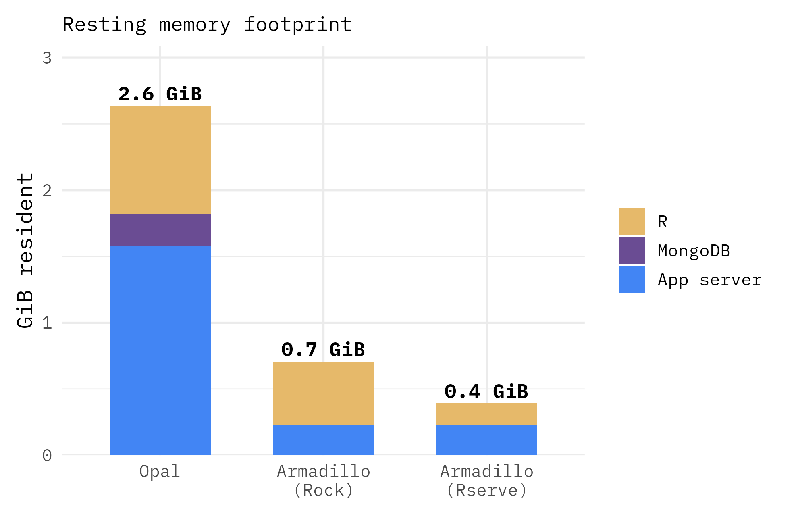
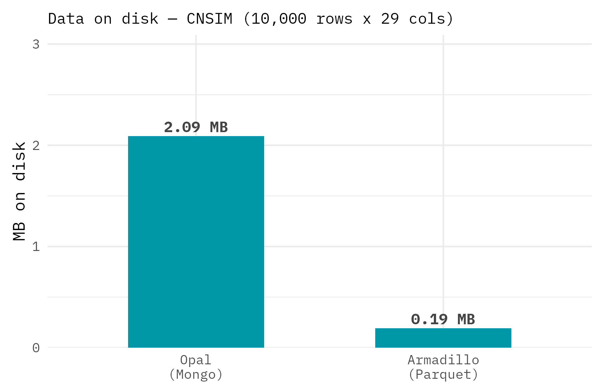
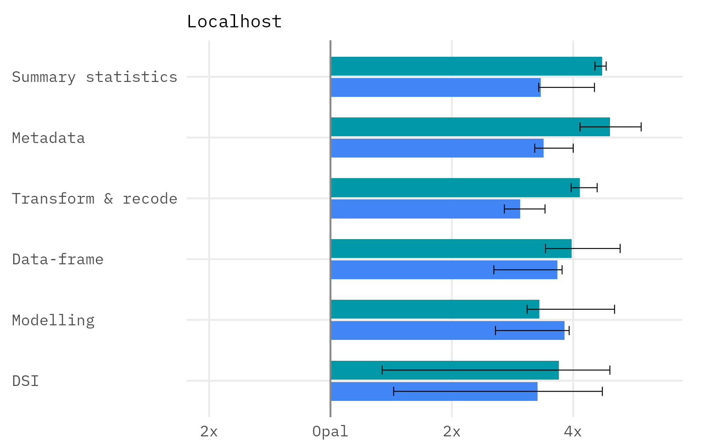
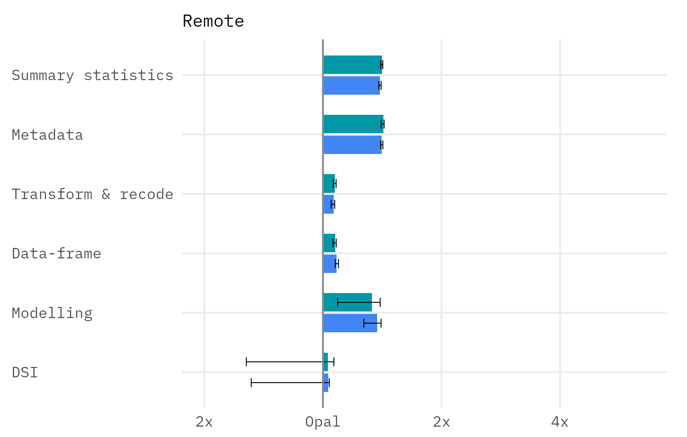

# Armadillo vs Opal
Data owners wanting to implement DataSHIELD have two backend options - Armadillo and Opal. How do these differ? Opal 
offers a broader set of features - not just a DataSHIELD backend but also variable dictionaries and harmonisation. 
Armadillo was designed to be quicker and more light-weight than Opal, using parquet storage over a relational database. 
Its features were designed exclusively to implement federated analysis.

## Performance advantages of Armadillo
To demonstrate the performance advantages of armadillo, we compared common operations using the dsBase package performed 
on both Armadillo and Opal using equally-specced machines. Both backends ran **dsBase 6.3.5** on **2 vCPU / 8 GiB**
machines, tested both on `localhost` and over a network ("remote"). Armadillo was tested with both its R engines — **Rock** 
and **Rserve**; Opal was tested with **Rock**.

Speed was measured across **44 common analysis functions** grouped into six families (summary statistics, 
metadata/introspection, transform & recode, data-frame manipulation, modelling, and DataSHIELD infrastructure calls). 
Each function was timed over **5 shuffled passes of 5 repetitions**, randomising call order each pass to avoid ordering effects.

### Footprint

{ width="420" }

{ width="420" }

At rest, Armadillo used substantially less memory: about **0.7 GiB** with Rock and
**0.4 GiB** with Rserve, against **2.6 GiB** for Opal (which additionally runs MongoDB).
Storing the same 10,000-row dataset, Armadillo's Parquet files occupied **0.19 MB** versus
**2.09 MB** for Opal's MongoDB store.

## Speed

Relative to Opal in the **same** environment (bars to the right of the centre line mean
Armadillo is faster):

=== "Localhost"
    { width="720" }

    On the same machine, Armadillo completed the operations roughly **3–4× faster** than
    Opal across every family. Rserve was generally a little faster than Rock.

=== "Remote"
    { width="720" }

    Over a network the advantage narrows to roughly **1.2×**, as the speed advantages of Armadillo are diulted by
    **network latency** (~160 ms per round-trip), which both backends share equally.

## Summary

| Dimension | Finding |
|---|---|
| Resting memory | ~0.7 GiB (Rock) / ~0.4 GiB (Rserve) vs 2.6 GiB (Opal) |
| Disk (10k rows) | 0.19 MB (Parquet) vs 2.09 MB (MongoDB) |
| Speed (localhost) | Armadillo ~3–4× faster than Opal |
| Speed (remote) | Armadillo ~1.2× faster; network latency dominates |
| Rock vs Rserve | Rserve slightly faster, mainly on localhost |

In short, in this benchmark Armadillo was **quicker and more light-weight** than Opal on the
DataSHIELD workload. **Chose Armadillo** if you want a light-weight, quicker backend focused exclusively on federated analysis, 
**choose Opal** if you need the richer feature set and footprint & performance are a lower priority.
