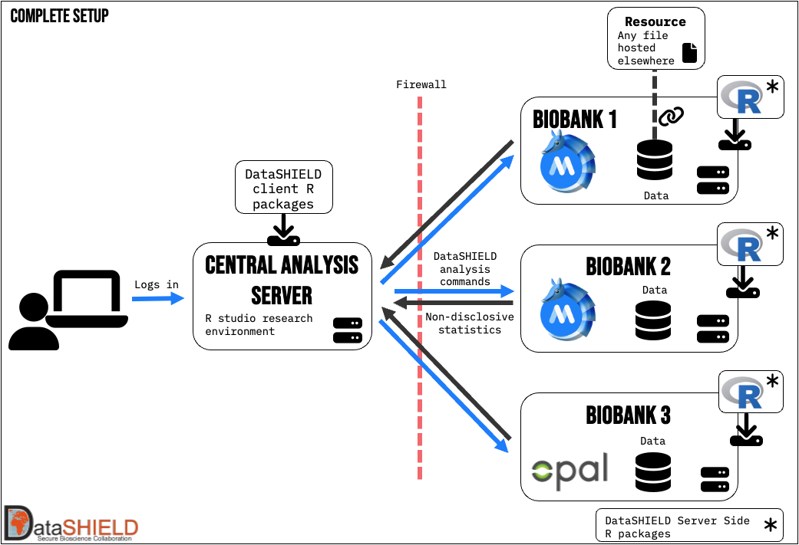

# Basic concepts
MOLGENIS Armadillo is software that facilitates the DataSHIELD infrastructure. DataSHIELD allows for secure data science
collaboration. It's designed for remote, non-disclosive analysis of sensitive data and is very suitable for federated
analysis. 

The best way to explain how this all works, is by visualising it. Below you see the most simple setup possible for using
DataSHIELD in production.

{ width="600" }
/// caption
A user writes analysis code in R and sends it to the biobanks that run DataSHIELD using either Armadillo or Opal. They'll receive the non-disclosive statistics back as response.
///

Explain difference between r-client and UI, and different users. DataSHIELD infrastructure, federated analyses. Armadillo role.
