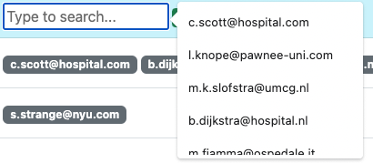
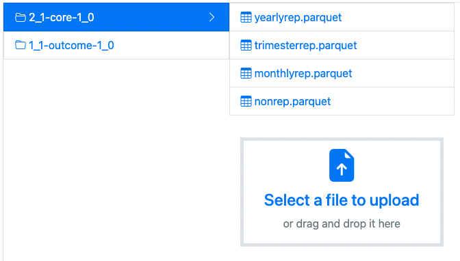
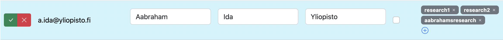
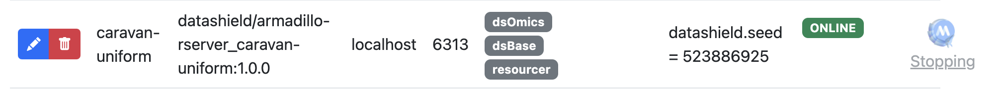

# Basic Usage

Depending on your [role](./quick_start.md#quick-start) you have different options to interact with MOLGENIS Armadillo.

=== ":material-layers-search: Researcher"

    A [researcher](./quick_start.md#researcher) will connect to a Armadillo server with a R client [DSMolgenisArmadillo](https://molgenis.github.io/molgenis-r-datashield/), this client allows for execution of DataSHIELD functions. Depending on the way your cohort has been setup you might use the R client through the Central Analysis server (CAS). In both cases the researcher has installed R and Rstudio to edit and run their analysis.

=== ":material-file-table: Datamanager"

    A [datamanager](./quick_start.md#data-manager) will typically interact with Armadillo in multiple ways:
    
    - Using the Armadillo User Interface (UI)
    - Using a R client [MolgenisArmadillo](https://molgenis.github.io/molgenis-r-armadillo/)
    - Using [dsUpload](https://lifecycle-project.github.io/ds-upload/) (R) to upload data with the help of predefined harmonised data dictionaries ([ds-dictionaries](https://github.com/lifecycle-project/ds-dictionaries)).

=== ":material-server: System Operator"
    Authentication server: https://lifecycle-auth.molgenis.org/

=== ":fontawesome-solid-laptop-code: Developer"

    DSLite

## Armadillo UI

Relevant for: :material-file-table:{title="Datamanagers"}

Armadillo features a user interface, or UI for short.

### Login


To login to the UI, select the **Institute account (oath2)** button and login using the institute or organisation login screen you will be redirected to.

#### Superuser

You need to have admin or superuser permissions if you want to add projects, users or profiles. This means you need to be granted permission in order to be able to use the UI. If you don't have correct permissions, you will receive the
following error:


If you receive this error, contact someone in your institute that is already able to login without an error, or if you don't have anyone available, send an email to MOLGENIS Support (molgenis-support@umcg.nl).

To grant a user superuser permissions simply search for that user in the `Users` tab of the UI, and tick the _admin_ checkbox for that user:


### Projects

Once you're logged in, you will be redirected to the `Projects` page. On this page you can add and edit projects.

You can add users to projects and navigate to the "project-editor"-view and search through the projects using the search bar on the top right.


#### Editing projects

To edit your project, click on the edit button in front of the project you want to edit: {width="15"}.

The row will be opened in edit mode:


The edit mode can be recognized by its blue background color and you have the option to add new users to your project by clicking on the + button {width="15"} of the users column. Then, you can either select an existing user from the dropdown, or add the email address of a new user.



In case of adding a user in this screen, a warning will be shown to prevent email addresses with typographical errors from being added to your system. For example, if you have the address `j.doe@example.com` in your users table but attempt to add `j.die@example.com` a warning message will be displayed asking if you want to add a new user.


It is not possible to edit the name of your project; this is intentional in order to ensure tables, resources, users, and permissions are transferred to the new project name correctly.

Click on the checkmark {width="25"} to save the edited row and the X {width="25"} to cancel.

Be careful, if you do cancel your changes will be lost.

#### Adding projects

To add a new project, click on the + button {width="25"} on top of the table. If you click this button, an empty row will be opened in edit mode.


Click on the checkmark {width="25"} to save the edited row and the X {width="25"} to cancel.

Be careful, if you do cancel your changes will be lost.

### Project explorer

If you click on the icon {width="40"} next to the project name, you will be directed to the `project editor`. In this screen you can upload and preview data in projects. To go back to your `projects` page,
press the back button {width="25"}.


If you click on a folder, it will open.



Here you can upload files to that folder, or click on the tables (files) to preview their contents.


To upload files, either drag a file from your file browser to the file upload area, or click the area and select the
file.


After selecting the file, click on _upload_ to upload it. This usually only takes a few seconds but will take longer in your uploading a large file.

It is also possible to create new folders. To do so, click the "add folder" button 
{width="30"} just below the project name. An input dialog will be presented:


Fill in the name you want to use and click on the checkmark button {width="25"}. Please keep in mind that the folder will only be saved if you put data into it. Select the new folder to select files to upload.

#### Resources

All file types can be uploaded into Armadillo, however previews will only be available for `.parquet` files. Other files that can be uploaded are treated as _resources_. Resource filetypes usually are `.rda` files or `.Rdata` files.

To be able to use these resources as a researcher, first an `.rds` file must be generated. How to create these files, is described [here](https://molgenis.github.io/molgenis-r-armadillo/articles/create_resources.html).

The URL of your resources should consist of:

```r
{your url}/storage/projects/{project name}/objects/{name of the folder}%2F{the resource file}
```

Here is an example, with some example parameters:

```r
url = "https://armadillo3.demo.molgenis.net"
project = "omics"
folder = "ewas"
file = "gse66351_1.rda"
```

Which results in the following url:

```r
https://armadillo3.demo.molgenis.net/storage/projects/omics/objects/ewas%2Fgse66351_1.rda
```

### Users

The `Users` page works just as the `Projects` page. You can search users by entering (a part of) the email address or name of the user into the search box:


#### Editing users

Users can be edited, **except** for their email addresses. This is because when user's email address changes, that user is possibly no longer working for the same institution and therefore might not be allowed to access the data anymore.



In edit mode, the row will turn blue. Projects can be added by clicking on the + icon {width="15"}in the projects column.

{width="350"}

You can add a new project by typing it and clicking the checkmark button {width="25"}. You will be prompted with a warning message, asking you to confirm if you want to add a new project.

Alternatively, you can select an existing project by using the search box or scrolling through the presented list.

#### Adding users

By clicking on the plus button {width="25"} on the top of the table, a new user can be added. The row with the new user will turn blue in edit mode.

{width="650"}

Users can be added before they have logged in previously. These users can be added to projects, which will grant them permission to use the data from those projects upon their first login. Researchers should not be set as admin.

### Analysis Profiles


Since the release of Armadillo 3.0.0, it is possible to create and manage analysis profiles in the user interface, rather than asking system administrators to manage these profiles. You can start {width="35"} and stop {width="35"} profiles.

When you start a profile for the first time, it will take a bit longer to load because the profile needs to be downloaded and installed before it can be started.



If you switch to another screen whilst either starting or stopping a profile, the profiles page will no longer show the loading information. It is however still loading, and when it's done, if you reload the page, you will see that your profile started or stopped successfully.

As in the other screens, you can add profiles with the add-button {width="25"}.


By default, some fields will be set. Please update them to install the correct profile.

Possible images can be found on [dockerhub](https://hub.docker.com/search?q=datashield%2Farmadillo-rserver). We recommend selecting one of the
[DataSHIELD standard profiles](https://wiki.datashield.org/en/opmanag/standard-profiles-and-platforms). The image name of those profiles can be found on the dockerhub link above.

Although the default `port` setting should find an available port, please keep in mind that the port has to be unique, otherwise you cannot start your profile and will receive an error message.

R packages can be whitelisted by adding them to the `package whitelist` column so researchers can use them. 'Whitelisting' a package allows analysts to use it. If you want to whitelist a package, you need to make sure it is installed on the image you selected. Additionally, it is possible to blacklist certain R functions in the `blacklist function` column. This can be useful if certain functions are not allowed to be used on certain data or within certain cohorts.

## Central Analysis Server (CAS)

Relevant for: :material-layers-search:{title="Researchers"}

Most networks use the analysis environment instead of their locally installed R/Rstudio environment. The analysis environment is centralized. You will be using a web based RStudio which is available here: [https://lifecycle.analysis.molgenis.org/](https://lifecycle.analysis.molgenis.org/)

The benefit of using a CAS server is a additional layer of security, only traffic from the CAS server is accepted by the Armadillo server.

## DSMolgenisArmadillo

Relevant for: :material-layers-search:{title="Researchers"}

Use [DSMolgenisArmadillo](https://molgenis.github.io/molgenis-r-datashield/) to analyse data shared in MOLGENIS Armadillo servers using DataSHIELD. DataSHIELD allows execution of a subset of analysis methods available in R. Methods such as:

`ds.mean()` `ds.glm()` `ds.lmerSLMA()`

For more detailed information please visit [DSMolgenisArmadillo](https://molgenis.github.io/molgenis-r-datashield/) and additionally check the documentation: [https://cran.datashield.org/](https://cran.datashield.org/).

=== "Prerequisite"

    ???+ example

        ```r linenums="1" title="Prerequisite.r"
        install.packages("DSI")
        install.packages("DSMolgenisArmadillo")
        install.packages("dsBaseClient", repos = c("http://cran.datashield.org", "https://cloud.r-project.org/"), dependencies = TRUE)

        library(dsBaseClient)
        library(DSMolgenisArmadillo)
        ```
=== "Basic usage"
    ??? example

        ```r linenums="1" title="Analyse_data_subset_DSMolgenisArmadillo.r"
            library(dsBaseClient)
            library(DSMolgenisArmadillo)

            # specify server url
            armadillo_url <- "https://armadillo.test.molgenis.org"

            # get token from central authentication server
            token <- armadillo.get_token(armadillo_url)


            # build the login dataframe
            builder <- DSI::newDSLoginBuilder()
            builder$append(
            server = "armadillo",
            url = armadillo_url,
            token = token,
            table = "workshop1/2_1-core-1_0/nonrep",
            driver = "ArmadilloDriver"
            )

            # create loginframe
            logindata <- builder$build()

            # login into server
            conns <- datashield.login(
            logins = logindata, 
            symbol = "core_nonrep", 
            variables = c("coh_country"), 
            assign = TRUE
            )

            # calculate the mean
            ds.mean("core_nonrep$coh_country", datasources = conns)

            ds.histogram(x = "core_nonrep$coh_country", datasources = conns)
        ```

!!! info
    A researcher only has access to data if he/she has been granted access to this data (typically) by a data manager or administrator of a cohorts Armadillo server.

!!! note
    The example files used in the examples above can be found here: [nonrep.parquet](../data/nonrep.parquet), [yearlyrep.parquet](../data/yearlyrep.parquet)

    Load these `parquet` files in R and see which variables you can call.

## MolgenisArmadillo

Relevant for: :material-file-table:{title="Datamanagers"}

[MolgenisArmadillo](https://molgenis.github.io/molgenis-r-armadillo/) is a R library that can be used by data managers to share datasets on a MOLGENIS Armadillo server. Researchers can then analyse these datasets and datasets shared on other servers using DataSHIELD. Researchers will only be able to access aggregate information and cannot see individual rows.

For more detailed information please visit [MolgenisArmadillo](https://molgenis.github.io/molgenis-r-armadillo/index.html).

Below some basic operations to get you started using MolgenisArmadillo:

=== "Prerequisite"

    ???+ example

        ```r linenums="1" title="Prerequisite.r"
        # install the following packages
        install.packages("MolgenisArmadillo")
        install.packages("dplyr")
        install.packages("arrow")
        # After installation make sure you can load the libraries
        library(MolgenisArmadillo)
        library(dplyr)
        library(arrow)
        # verify the loaded libraries (see: other attached packages)
        sessionInfo()
        ```
=== "Basic usage"

    ??? example

        ```r linenums="1" title="MolgenisArmadillo.r"
            ## Prerequisites
            #
            # - Run the code in Prerequisite.r
            #
            library(MolgenisArmadillo)

            ## 
            # To share your data using Armadillo, you first need to login

            ## Login
            #
            # In order to access the files as a data manager, you need to log in. 
            # The login method needs the URLs of the Armadillo server.
            # It will open a browser window where you can identify yourself with the ID provider.
            # 
            # If you are unsure how this login function (or any function) works ask R to provide documentation
            ?armadillo.login

            armadillo.login(
                armadillo = "https://armadillo.test.molgenis.org"
            )
            #token <- armadillo.get_token("https://armadillo.test.molgenis.org")

            # armadillo.login will create a session and store the credentials in the environment.

            ## Structure
            # To share data via Armadillo you can have a nested structure to save you data.

            # We distinguish:
            # - projects
            # - folders
            # - tables

            ### Projects
            # Projects are root-folders you can give persons permissions on. 
            # you can imagine that you will use a separate project for each study you need to support. 
            # This way you make sure people can not see each others variables.

            ### Folders
            # Folder objects can be used to version the different tables you want to share in Armadillo. 
            # This is not mandatory and are free to use the folder level as you see fit. 
            # In our examples we will go into the versioning part a bit deeper.

            ### Tables 
            # Tables contain the data you want to share. 
            # This can be all the data on a certain subject, mostly used in consortia or a specific study you want to expose.

            ## Sharing data
            # Assume you are in a consortia which has core-variables and outcome-variables. 
            # You want to share and version the whole dataset to all researchers which applied to access your data.

            # First we will create the project. In our case "ipec".

            cohort <- "workshop2"
            armadillo.create_project(cohort) 

            # Secondly we will load the table(s) we want to upload to Armadillo in the R-environment. 
            # We have test data which is in `arrow` format, the upload will take any object that has a table like structure to upload into the Armadillo. 
            # This can be SPSS, STATA, SAS or R-based data as well.

            library(arrow)

            # load the core data (make sure you are working in the correct directory)
            nonrep <- arrow::read_parquet("data/nonrep.parquet")
            yearlyrep <- arrow::read_parquet("data/yearlyrep.parquet")

            # explore your data (sanity check)
            View(nonrep)
            dim(nonrep)
            names(nonrep)
            table(nonrep$recruit_age)

            # The third step is determining the second level, which contains in this case the datamodel-version the type of variables and the data-version.

            # y_y-#variable-type#-x_x
            
            # y_y = datamodel version
            # x_x = data version

            # upload the core variables
            armadillo.upload_table(cohort, "2_1-core-1_0", nonrep)
            armadillo.upload_table(cohort, "2_1-core-1_0", yearlyrep)

            ## Looking at the data
            # There are helper functions to help you determine what is in the storage server. 
            # You can list projects and tables to what's in the storage.

            # list of projects
            armadillo.list_projects()

            # listing tables per project
            armadillo.list_tables(cohort)

            # You can download the data in the R-environment as well.

            # download table to local R environment
            download_nonrep <- armadillo.load_table(cohort, "2_1-core-1_0", "nonrep")

            # check the column names from the local environment
            colnames(download_nonrep)

            # check if local data and uploaded data are equal (optional)
            setequal(nonrep, download_nonrep)

            # Now you can also take a look at the files in the user interface of the MinIO file server
            # open the MinIO server URL in a browser window (used in armadillo.login).

            # > !IMPORTANT: run this part after subsetting the data

            ## Deleting the data 
            # To delete the data you need to throw away the contents first.

            # throw away the core tables
            armadillo.delete_table(cohort, "2_1-core-1_0", "nonrep")
            armadillo.delete_table(cohort, "2_1-core-1_0", "yearlyrep")

            # Now you can delete the project.
            armadillo.delete_project(cohort)
        ```
=== "Create subsets"

    ??? example

        ```r linenums="1" title="Creating_data_subsets_Armadillo.r"
        ## Creating data subsets on the Armadillo server
        # When researchers request access to your data they may in many cases not be granted access to the whole data set, but only to a subset. 
        # Here you can see the different relevant steps you need to take to create these subsets.
        #
        # - Setting up the environment
        # - Logging into the servers
        # - Exploring the data
        # - Making subsets of the data
        # - Upload data subsets
        #
        # - Delete data subsets

        ## Setting up the environment
        # - Run the code in 0_Prerequisite.r

        # load required libraries
        library(MolgenisArmadillo)
        library(dplyr)

        ## Logging in to the servers
        # In order to access the files you need to log in using the URLs of the Armadillo server. 
        # A browser window will be opened where you can identify yourself with the ID provider.

        armadillo.login(
            armadillo = "https://armadillo.test.molgenis.org"
        )
        # A session will be created and the credentials are stored in the environment.

        ## Explore the data
        # Let's assume you are in a consortium which has core-variables and outcome-variables. 
        # You want to share a subset of the whole data set with certain researchers that applied for access to your data.

        # List projects on the Armadillo server.
        armadillo.list_projects()

        # Next create a study, here called 'subset1'.
        # NOTE: change the name of the subset for your own practice run

        study <- "study1"
        armadillo.create_project(study)

        # List the tables in a project

        # You want to share data from the cohort you just uploaded (MolgenisArmadillo.r). 
        # Change the cohort_name to your own cohort name here:
        cohort = "workshop1"

        # List the available tables within this project.
        armadillo.list_tables(cohort)

        # Subset the core variables
        # Download the relevant core tables to the local environment

        nonrep <- armadillo.load_table(cohort, "2_1-core-1_0", "nonrep")
        yearlyrep <- armadillo.load_table(cohort, "2_1-core-1_0", "yearlyrep")

        # List their variables

        colnames(nonrep)
        colnames(yearlyrep)

        # Subset the variables that were requested per table.

        subset_core_nonrep <- nonrep %>% select(child_id, asthma_m, preg_cig, preg_fever, preg_alc)
        subset_core_yearlyrep <- yearlyrep %>% select(child_id, cohab_, smk_exp)

        ## Uploading the data subset
        # Check the variables in the data subset before uploading

        colnames(subset_core_nonrep)
        colnames(subset_core_yearlyrep)

        # Upload the data subsets
        armadillo.upload_table(study, "2_1-core-1_0", subset_core_nonrep, "nonrep")
        armadillo.upload_table(study, "2_1-core-1_0", subset_core_yearlyrep, "yearlyrep")

        # See if tables are uploaded
        armadillo.list_tables(study)

        # Now you can also take a look at the files in the user interface of the Armadillo server. In this case: https://armadillo.test.molgenis.org/#/projects

        # > !IMPORTANT: run this part after subsetting the data

        ## Deleting the data 
        # To delete the data you need to throw away the contents first.

        # throw away the core tables
        armadillo.delete_table(study, "2_1-core-1_0", "nonrep")
        armadillo.delete_table(study, "2_1-core-1_0", "yearlyrep")

        # Now you can delete the project.

        armadillo.delete_project(study)
        ```

!!! note
    The example files used in the examples above can be found here: [nonrep.parquet](../data/nonrep.parquet), [yearlyrep.parquet](../data/yearlyrep.parquet)


## DsUpload & DsDictionaries

Relevant for: :material-file-table:{title="Datamanagers"}

DataSHIELD upload tools ([DsUpload](https://lifecycle-project.github.io/ds-upload/)) s a collections of tools used to upload data into DataSHIELD backends like Armadillo and Opal. It aids data managers in the initial stages of uploading data to DataSHIELD backends.

DsUpload depends on [DsDictionaries](https://github.com/lifecycle-project/ds-dictionaries) which holds the [harmonised data dictionaries](https://github.com/lifecycle-project/ds-dictionaries/tree/master/dictionaries) of multiple projects like [Lifecycle](https://data-catalogue.molgeniscloud.org/catalogue/ssr-catalogue/LifeCycle) and [Athlete](https://data-catalogue.molgeniscloud.org/catalogue/ssr-catalogue/ATHLETE).

!!! info
    Visit MOLGENIS [European Health Research Data and Sample Catalogue](https://data-catalogue.molgeniscloud.org/) which is used by projects like Lifecycle and Athlete to harmonise their variables!

## DSLite

Relevant for: :fontawesome-solid-laptop-code:{title="Developers"}

DataSHIELD Lite ([DSLite](https://github.com/datashield/DSLite)) is a serverless [DataSHIELD Interface (DSI)](https://datashield.github.io/DSI/) implementation which purpose is to mimic the behavior of a distant (virtualized or barebone) data repository server like Armadillo or Opal. The datasets that are being analyzed are fully accessible in the local environment. The DataSHIELD configuration (set of allowed aggregation and assignment functions) is discovered at runtime by inspecting the DataSHIELD server-side R packages installed locally. This configuration can also be amended or provided explicitly.

DSLite can be used to:

- speed up development and testing cycle when developing new DataSHIELD functions (both at server and client side): no need to deploy a data repository infrastructure.
- allow DataSHIELD analysis with combined datasets, some of them being accessible remotely in secure data repositories, others being privately accessible (in a governmental institution for instance).

## Authentication server

Relevant for: :material-server:{title="System Operator"}