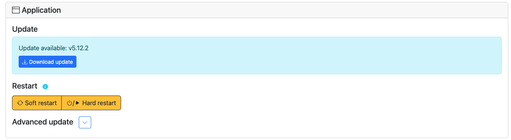
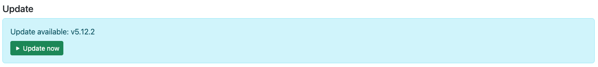
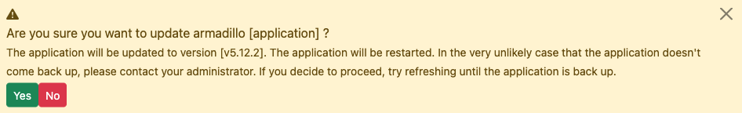
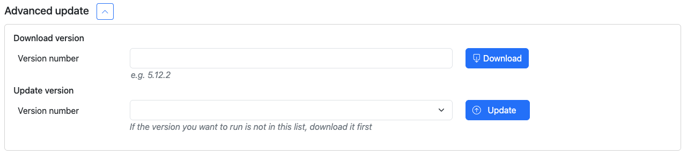
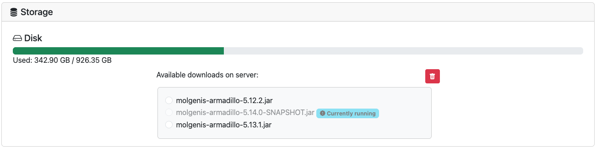

# Control Armadillo

    
        <svg xmlns="http://www.w3.org/2000/svg" width="16" height="16" fill="#353535" class="bi bi-tag" viewBox="0 0 16 16">
            <path d="M6 4.5a1.5 1.5 0 1 1-3 0 1.5 1.5 0 0 1 3 0m-1 0a.5.5 0 1 0-1 0 .5.5 0 0 0 1 0"/>
            <path d="M2 1h4.586a1 1 0 0 1 .707.293l7 7a1 1 0 0 1 0 1.414l-4.586 4.586a1 1 0 0 1-1.414 0l-7-7A1 1 0 0 1 1 6.586V2a1 1 0 0 1 1-1m0 5.586 7 7L13.586 9l-7-7H2z"/>
        </svg>
    
    5.14.0

Relevant for: :material-server:{title="System Operator"} 
:material-file-table:{title="Data Managers"}

!!! info
    In order to use the control page for anything other than a soft restart, python needs to be installed on the Armadillo server.

On the control page, Armadillo administrators (anyone with admin rights, including data managers) can control the 
application, easing some responsibilities of the system administrator. 

## Update
Armadillo can be updated from the User Interface. To check for available updates, go to `System > Control`. If an update
is available, an alert will pop up at the top of the page.

In order to update, first click on the "Download update button". The update will download:

When the download is finished, the update button can be pushed:

A confirmation dialog will appear:

After reading the message carefully and agreeing to what it is saying, press "Yes". 
The application will be down for a short period of time, attempting the update. Refresh until armadillo is back up.
If updating failed, armadillo will attempt to roll back the previous version. If restarting Armadillo has failed, 
Armadillo will repeatedly retry to start back up. If Armadillo doesn't seem to come back up, contact your system
administrator for help.

### Updating to a different version
If you want to update to a different version than the last stable one that will show up in the update alert, you can 
click the button next to Advanced update to reveal the advanced update features: 

Here any tag available in 
[the armadillo github repository](https://github.com/molgenis/molgenis-service-armadillo/releases) . 
After downloading a version, it can be selected in the "Update version" dropdown to update to this specific version 
after pressing the "Update button".

## Restart
Within the control screen, it's also possible to restart the armadillo server. There are two options: 

- Soft restart
- Hard restart

### Soft restart
This will attempt to restart within the application itself, without truly bringing it down. This button works even if 
python is not installed on your armadillo. Because armadillo is never truly brought down, risks of it not coming back 
up are slightly decreased. In the very unlike scenario that Armadillo doesn't come back up, contact your administrator.

### Hard restart
This will trigger a full restart of the application, calling a script that will bring armadillo down and later back up. 
If this process fails, the script will keep attempting to restart 10 times after increasing periods of time 
(4 seconds, 8 seconds, 16 seconds, etc.). In the very unlike scenario that Armadillo doesn't come back up, contact your
administrator.

## Storage
Because downloading Armadillo versions can fill up the server, it is possible to delete downloaded versions that are not
in use. To do so, scroll to the "Storage" section. Select the version you want to delete and push the delete button. 

## Authentication server
The last section on the Control page is "Authentication Server". Information about this can be found in the 
[Authentication server section](http://127.0.0.1:8000/molgenis-service-armadillo/pages/basic_usage/auth/#ui) of this 
documentation.