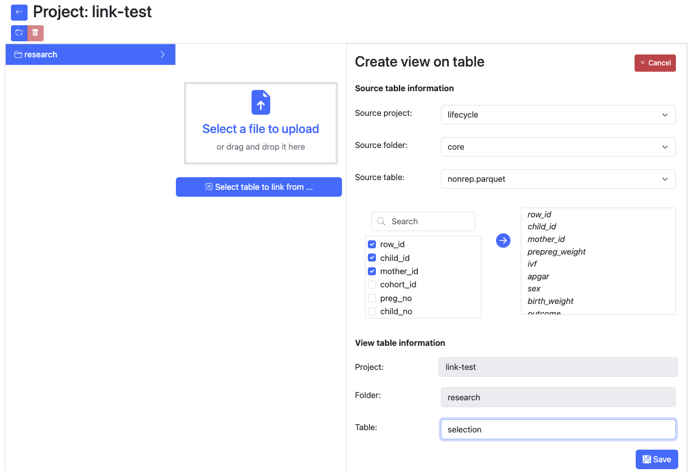
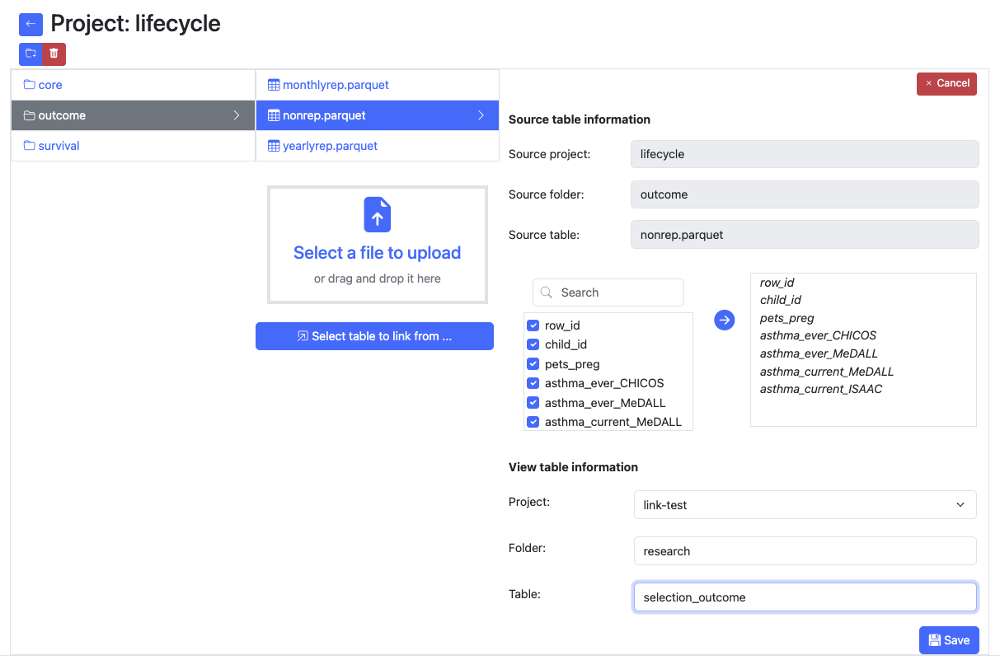
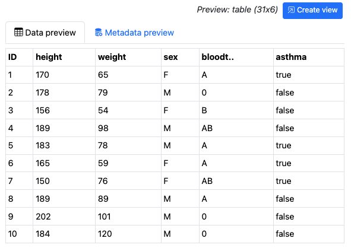
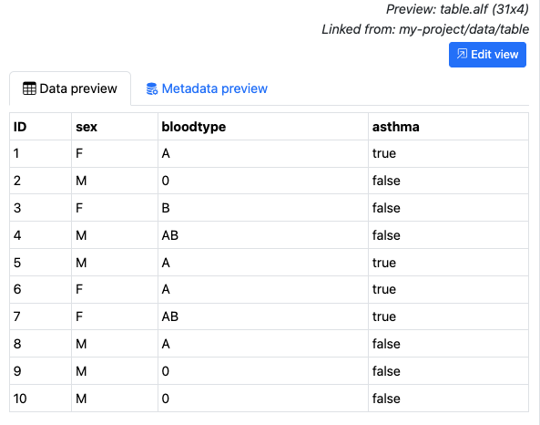
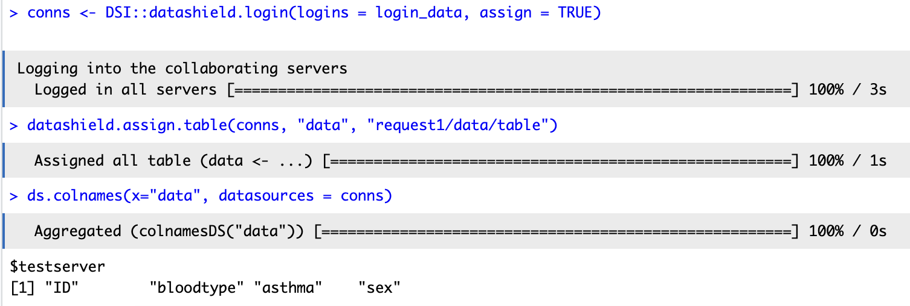

# Creating Subsets/Views in Armadillo UI
When researchers request access to your data, they may not be granted access to the whole dataset, but only to the variables which they will use in their project.
In Armadillo, access is regulated on the project level, so you will need to create a view (subset) containing only these variables.

When creating a subset, an Armadillo Link File (".alf") file will be created. Giving a researcher access to the project containing this file lets them use the selected variables from the source table. These values are not copied, the file simply records which variables Armadillo should grant access to.

This can be accomplished in two ways: 

## From the destination

Select the project and folder where the view should be created, this should be a different project than the source project, as permissions are set on project level. 
Click "Select table to link from ..."
Fill in the fields and click "Save".

## From the source
Select the table you want to create a subset from. Click on "Create view".


Fill in the fields and click on "Save".

## Armadillo Link File
Armadillo Link File (.alf) is a file format created to store the information that Armadillo needs to grant access to 
only certain variables of a complete dataset. If you were to open an .alf file, it would look like this:
```json
{
  "sourceObject":"core/nonrep",
  "sourceProject":"lifecycle",
  "variables":"row_id,child_id,mother_id,prepreg_weight,ivf,apgar,sex,birth_weight,outcome"
}
```

## Example with technical explanation
We have dataset: my-project/data/table.parquet.



We create a view from this table. That will be in project `request1` and folder `research`. This will result in the 
following file on the storage of the Armadillo server:
```json
{
  "sourceObject":"data/table",
  "sourceProject":"my-project",
  "variables":
  "ID,sex,bloodtype,asthma"
}
```
This will look like an actual table to the data managers:


For researchers it will also appear as though they connect to a table with only the selected variables in it:


To summarise, linkfiles are files that arrange for access to a limited number of variables of another table, without 
copying the data, saving storage on your server. For reference, the small table in the example above is 3KB, whereas the
link file is only 96 bytes. Bigger tables will take more storage, yet linkfiles will only increase slightly when more 
variables are selected.