# Armadillo UI

Relevant for: :material-file-table:{title="Data Managers"}

Armadillo features a user interface, or UI for short.

## Login

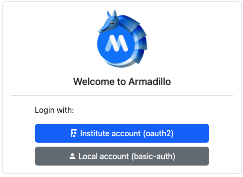

To login to the UI, select the **Institute account (oath2)** button and login using the institute or organisation login screen you will be redirected to.

### Superuser

You need to have admin or superuser permissions if you want to add projects, users or containers. This means you need to be granted permission in order to be able to use the UI. If you don't have correct permissions, you will receive the
following error:

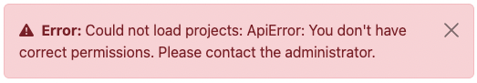

If you receive this error, contact someone in your institute that is already able to login without an error, or [contact MOLGENIS Support](../contact.md).

To grant a user superuser permissions simply search for that user in the `Users` tab of the UI, and tick the _admin_ checkbox for that user:

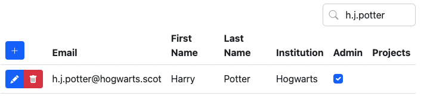


## Projects

Once you're logged in, you will be redirected to the `Projects` page. On this page you can add and edit projects.

You can add users to projects and navigate to the "project-editor"-view and search through the projects using the search bar on the top right.

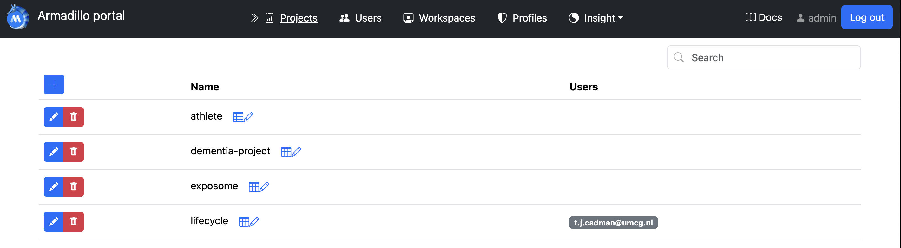

### Editing projects

To edit your project, click on the edit button in front of the project you want to edit: {width="15"}.

The row will be opened in edit mode:

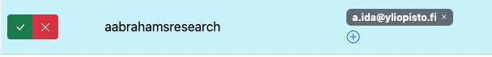

The edit mode can be recognized by its blue background color and you have the option to add new users to your project by clicking on the + button {width="15"} of the users column. Then, you can either select an existing user from the dropdown, or add the email address of a new user.

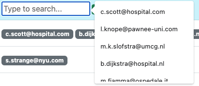

In case of adding a user in this screen, a warning will be shown to prevent email addresses with typographical errors from being added to your system. For example, if you have the address `j.doe@example.com` in your users table but attempt to add `j.die@example.com` a warning message will be displayed asking if you want to add a new user.

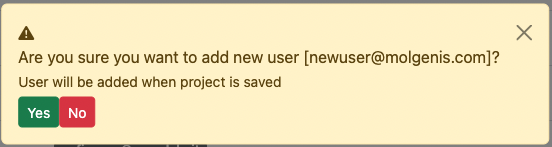

It is not possible to edit the name of your project; this is intentional in order to ensure tables, resources, users, and permissions are transferred to the new project name correctly.

Click on the checkmark 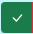{width="25"} to save the edited row and the X {width="25"} to cancel.

Be careful, if you do cancel your changes will be lost.

### Adding projects

To add a new project, click on the + button {width="25"} on top of the table. If you click this button, an empty row will be opened in edit mode.

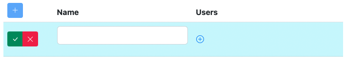

Click on the checkmark {width="25"} to save the edited row and the X {width="25"} to cancel.

Be careful, if you do cancel your changes will be lost.

## Project explorer

If you click on the icon {width="40"} next to the project name, you will be directed to the `project editor`. In this screen you can upload and preview data in projects. To go back to your `projects` page,
press the back button {width="25"}.

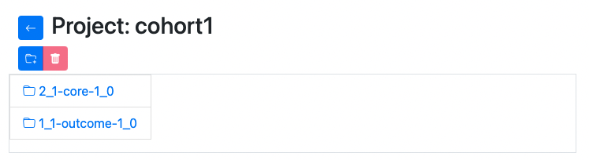

If you click on a folder, it will open.

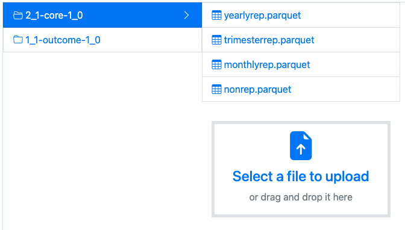

Here you can upload files to that folder, or click on the tables (files) to preview their contents.

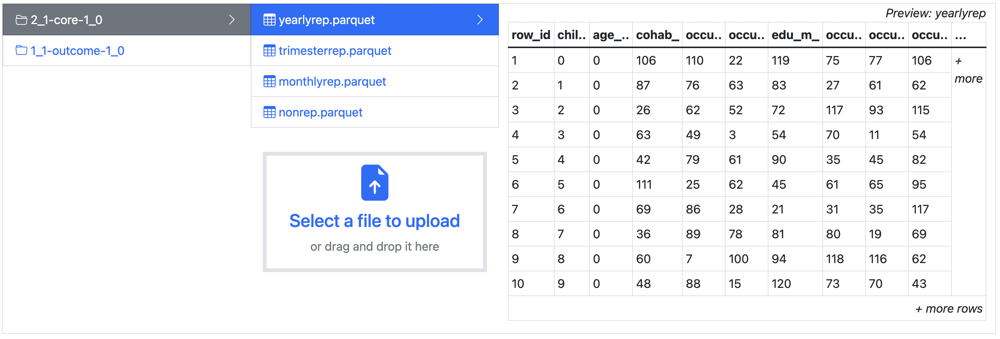

You can also see the metadata of the file you uploaded. For each column, the datatype will be shown in two ways: 
a more general term (string, integer, decimal, boolean, categorical) and the datatype as it is saved in armadillo 
(binary for string/categorical, boolean, int32 for integer, double for decimal). For all columns, the number and 
percentage of missing values will be shown. For categorical values, the different categorical options will be shown in
the 'levels' column.


To upload files, either drag a file from your file browser to the file upload area, or click the area and select the
file. If a csv or tsv file is selected, it's possible to convert them to a `.parquet` file, so it can be used as a 
table.

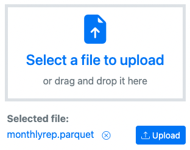

After selecting the file, click on _upload_ to upload it. This usually only takes a few seconds but will take longer in your uploading a large file.

It is also possible to create new folders. To do so, click the "add folder" button {width="30"} just below the project name. An input dialog will be presented:

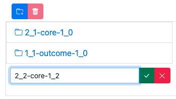

Fill in the name you want to use and click on the checkmark button {width="25"}. Please keep in mind that the folder will only be saved if you put data into it. Select the new folder to select files to upload.

### Resources

All file types can be uploaded into Armadillo, however previews will only be available for `.parquet` files. Other files that can be uploaded are treated as _resources_. Resource filetypes usually are `.rda` files or `.Rdata` files.

To be able to use these resources as a researcher, first an `.rds` file must be generated. How to create these files, is described [here](https://molgenis.github.io/molgenis-r-armadillo/articles/create_resources.html).

The URL of your resources should consist of:

```r
{your url}/storage/projects/{project name}/objects/{name of the folder}%2F{the resource file}
```

That means that the following parameters:

```r
url = "https://armadillo3.demo.molgenis.net"
project = "omics"
folder = "ewas"
file = "gse66351_1.rda"
```

Will result in this url:

```r
https://armadillo3.demo.molgenis.net/storage/projects/omics/objects/ewas%2Fgse66351_1.rda
```

## Users

The `Users` page works just as the `Projects` page. You can search users by entering (a part of) the email address or name of the user into the search box:


### Editing users

Users can be edited, **except** for their email addresses. This is because when user's email address changes, that user is possibly no longer working for the same institution and therefore might not be allowed to access the data anymore.

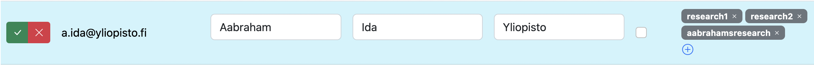

In edit mode, the row will turn blue. Projects can be added by clicking on the + icon {width="15"}in the projects column.

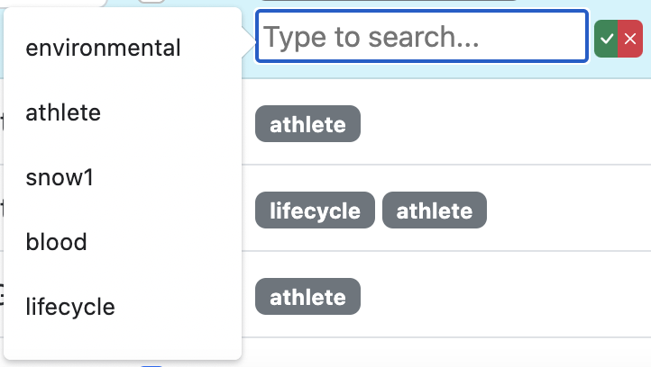{width="350"}

You can add a new project by typing it and clicking the checkmark button {width="25"}. You will be prompted with a warning message, asking you to confirm if you want to add a new project.

Alternatively, you can select an existing project by using the search box or scrolling through the presented list.

### Adding users

By clicking on the plus button {width="25"} on the top of the table, a new user can be added. The row with the new user will turn blue in edit mode.

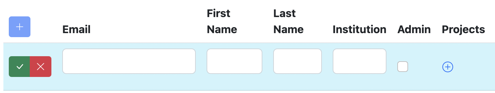{width="650"}

Users can be added before they have logged in previously. These users can be added to projects, which will grant them permission to use the data from those projects upon their first login. Researchers should not be set as admin.

## Workspaces

When users conduct analyses with DataSHIELD, they can save R workspaces on the server which saves any new objects they've created in their analysis. These workspaces take up space, and you may want to delete them once a researcher has finished their project. To do so, you can select a workspace and click the 'delete' button. You also have the option to delete all workspaces for one particular user.


## Analysis Containers


Since the release of Armadillo 3.0.0, it is possible to create and manage analysis containers in the user interface, rather than asking system administrators to manage these containers. You can start {width="35"} and stop {width="35"} containers.

When you start a container for the first time, it will take a bit longer to load because the image needs to be downloaded and installed before it can be started.

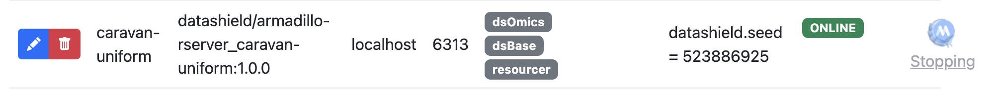

If you switch to another screen whilst either starting or stopping a container, the containers page will no longer show the loading information. It is however still loading, and when it's done, if you reload the page, you will see that your container started or stopped successfully.

As in the other screens, you can add containers with the add-button {width="25"}.

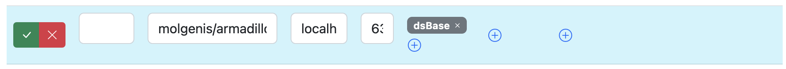

By default, some fields will be set. Please update them to install the correct container.

Possible images can be found on [dockerhub](https://hub.docker.com/search?q=datashield%2Farmadillo-rserver). We recommend selecting one of the
[DataSHIELD standard profiles](https://wiki.datashield.org/en/opmanag/standard-profiles-and-platforms). The image name of those profiles can be found on the dockerhub link above.

Although the default `port` setting should find an available port, please keep in mind that the port has to be unique, otherwise you cannot start your container and will receive an error message.

R packages can be whitelisted by adding them to the `package whitelist` column so researchers can use them. 'Whitelisting' a package allows analysts to use it. If you want to whitelist a package, you need to make sure it is installed on the image you selected. Additionally, it is possible to blacklist certain R functions in the `blacklist function` column. This can be useful if certain functions are not allowed to be used on certain data or within certain cohorts.

Sometimes containers are updated, for example if new features are added or security updates are applied. To manually update a container, you just need to start and stop the container and the new version will be installed. 

From Armadillo v.5.2.0 and higher, it is also possible to automatically update containers. Edit the container, check the 'Auto Update' box and schedule when you would like Armadillo to check for updates. At the scheduled time a check will be performed, and if there is an update available Armadillo will automatically install the latest version. 
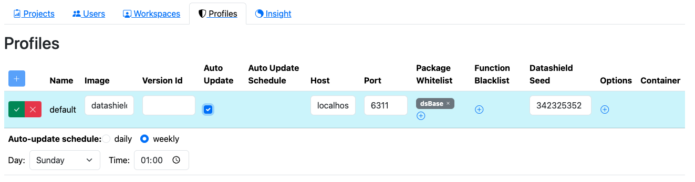
