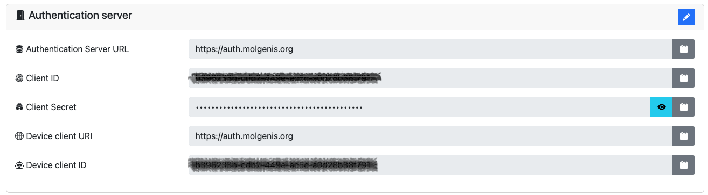

# Authentication server

Relevant for: :material-server:{title="System Operator"}

Authentication server: [https://lifecycle-auth.molgenis.org/](https://lifecycle-auth.molgenis.org/)

In order for OIDC to work on armadillo, an authentication server needs to be configured. In most cases, we will provide
you with OIDC credentials (email support@molgenis.org), otherwise you can configure your own authentication server.
Armadillo functions with FusionAuth, as well as KeyCloak. To configure this in armadillo, specify the following in the 
application.yml:

```yml
spring:
    oauth2:
      client:
        provider:
          molgenis:
            issuer-uri: https://the-auth-server
        registration:
          molgenis:
            client-id: the-client-id
            client-secret: the-client-secret
            authorization-grant-type:
              - authorization_code
              - refresh_token
      resourceserver:
        jwt:
          issuer-uri: https://the-auth-server # can be different one
        opaquetoken:
          client-id: the-device-flow-client-id
```
Note that both the opaquetoken and the client-id are specified here. 
In FusionAuth the client-id and opaguetoken client-id can be the same one. 
Device flow can be setup in the same configuration as regular login, in KeyCloak however, this is impossible. That means
that an additional configuration has to be set up to allow for device flow (as is required for login via DataSHIELD).

## UI
<div style="border: 1px solid #005EC4; border-radius: 3px; width: 6em; padding-top: 3px;">
    <span style="background-color:#D4ECFF; padding: 5px 0px 2.5px 5px; border-radius: 3px 0px 0px 3px; ">
        <svg xmlns="http://www.w3.org/2000/svg" width="16" height="16" fill="#353535" class="bi bi-tag" viewBox="0 0 16 16">
            <path d="M6 4.5a1.5 1.5 0 1 1-3 0 1.5 1.5 0 0 1 3 0m-1 0a.5.5 0 1 0-1 0 .5.5 0 0 0 1 0"/>
            <path d="M2 1h4.586a1 1 0 0 1 .707.293l7 7a1 1 0 0 1 0 1.414l-4.586 4.586a1 1 0 0 1-1.414 0l-7-7A1 1 0 0 1 1 6.586V2a1 1 0 0 1 1-1m0 5.586 7 7L13.586 9l-7-7H2z"/>
        </svg>
    </span>
    <span style="margin: 0 0 0.5em 0; border-left: 3px solid #017FFD; padding: 5px 0 3px 0.5em">5.14.0</span>
</div>
!!! info
    In order to (re)configure an authentication via the UI, python needs to be installed on the Armadillo server. 

After initial configuration, auth server configuration can be adjusted in Armadillo's UI. 
To do so, navigate to `System > Control`. Scroll to "Authentication server" and fill in the fields. Then save, read
the message carefully and press "Yes". The server will restart with the new configuration applied.




## Setup in FusionAuth
To configure a client in FusionAuth, add a configuration in Applications on your auth server. 
The Client Id and Client secret in this application configuration, as well as your auth server will need to be added
in above application.yml.

### oAuth tab
- Require authentication set to true
- Generate Refresh Tokens set to true
- Authorized redirect URLs: http://your-armadillo-url/login/oauth2/code/molgenis
- Enabled grants: Authorization Code, Device, Implicit, Refresh Token
- Device verification URL: https://auth.molgenis.org/oauth2/device

### JWT
- Enabled set to true
- JWT duration: 3600
- Refresh Token duration: 43200

### Security
- Require an API key set to true
- Generate Refresh Tokens set to true
- Enable JWT refresh set to true
- Authentication Tokens: Enabled set to true

## Setup in KeyCloak
### Regular Client ID
Create a new client to use as regular oidc client. Use the Client ID you configure in here as `molgenis.client-id` in 
above setup in the `application.yml`. For the secret, go to the Credentials tab and get the Client Secret there. Apply
the settings below.

#### Settings 
- Set Root, Home URLs, Web origins and Admin URL to the URL of your armadillo server
- Set valid redirect URLs: http://your-armadillo-url/login/oauth2/code/molgenis
- Set Valid post logout redirect URIs:  http://your-armadillo-url/logout
- Client authentication set to On
- Autorization set to off
- Authentication flow: Standard flow, Direct access grants, OAuth 2.0 Device Authorization Grant
- Login Settings: all off
- Logout settings: Front channel logout + Backchannel logout session required to on, 
Backchannel logout revoke offline sessions to off. 

#### Advanced
- Use refresh tokens set to On, all other OpenID Connect Compatibility Modes to Off. 

### Device flow client
Create a new client for this. Use the Client ID you configure in here as `opaquetoken.client-id` in above setup in the
`application.yml`.

#### Settings
- All URL's empty
- Client authentication and Authorization set to off
- Authentication flow: OAuth 2.0 Device Authorization Grant

#### Advanced
- Use refresh tokens set to On, all other OpenID Connect Compatibility Modes to Off. 
