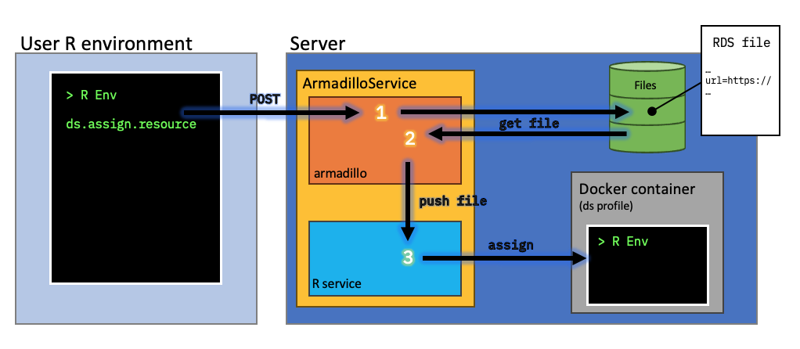
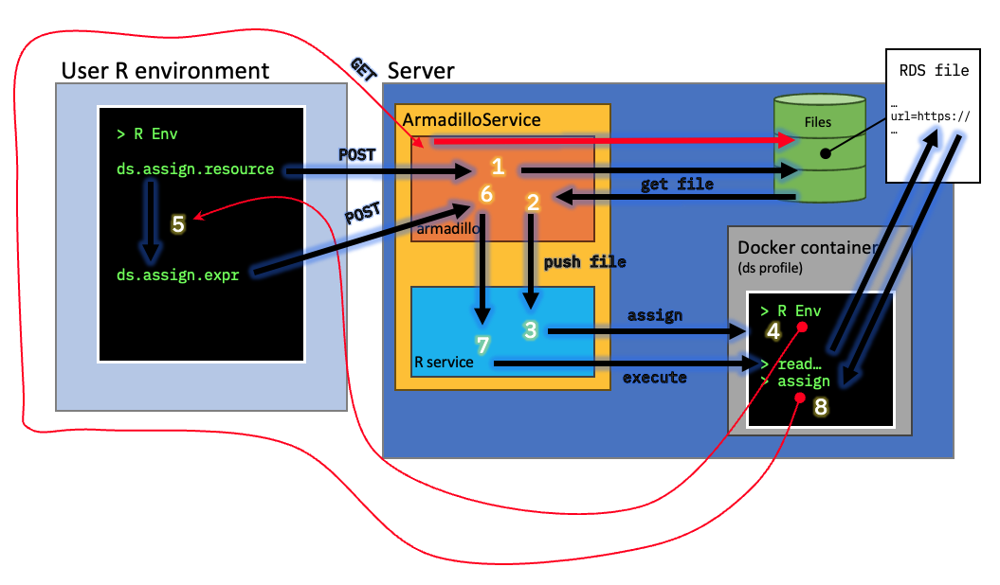

# Data in Armadillo
This page aims to describe how data is kept and managed within Armadillo. Armadillo doesn't have an underlying database
managing data, instead data is stored directly on the server on which armadillo is installed. Tabular data is stored in 
`.parquet` files and other files can be used and imported using the [`resourcer`]('https://github.com/obiba/resourcer') 
package. 

## Tabular files
Most data in armadillo, is stored in a tabular format. The file format we use for that is
[`.parquet`](https://parquet.apache.org/docs/), a format that is designed to efficiently store and retrieve tabular
data. To get your tabular data in Armadillo, either upload a csv/tsv (comma separated values or tab separated values) 
file using the Armadillo user interface, or use the 
[Armadillo R Package](https://github.com/molgenis/molgenis-r-armadillo). The image below illustrates how parquet files 
are stored and managed within armadillo, in this example data is requested via DataSHIELD.

/// caption
1. The researcher gives the assign command in their R environment, this is posted to an endpoint in the armadillo application.
2. The application requests the file to be assigned from the file system.
3. The file is pushed to the part of the application where connection with the R environment of the server resides.
4. An assign of the file is done in the server's R environment, making it available to the user to do their research with.
///

## Other file formats
Armadillo technically supports all file formats. In order to allow researchers to use them however, they have to be made
accessible. Because these files can be anything, it's harder to determine how to assign them in the researcher's 
environment. To address this problem, these files are made accessible as "resources", these are files that act like 
symlinks, pointing to where the actual file resides. An R package is used to create those "resources". This R package 
is called [`resourcer`]('https://github.com/obiba/resourcer'). 

Resource files are handled similar to tabular files:

In order to reach the actual data however, the link to the data has to be assigned. Then the proccess looks like this:

/// caption
1. The researcher gives the assign command in their R environment, this is posted to an endpoint in the armadillo 
application.
2. The application requests the file to be assigned from the file system.
3. The file is pushed to the part of the application where connection with the R environment of the server resides.
4. An assign of the file is done in the server's R environment, making it available so that it can be read so the actual
file can be accessed. 
5. A second command has to be done to make the connection with the actual data. 
6. The request is processed by Armadillo
7. It is passed through the R connection of Armadillo, giving the command to assign the resource in the researcher's
environment.
8. The file is assigned and made available to the user.
///

## Security
In the scenario where tables are assigned in the researcher's environment, data is being pushed through the application,
to the research environment. That way it is ensured, that data does not leave the application unless prompted. For
other files, the process is slightly different. The R environment has to do a GET request to the application to assign
data to the researcher's environment. A hidden endpoint, that is only reachable using a short-lived self-signed internal
token, is generated by the application through the assigning process. This token grants temporary access to these 
resources. The default lifespan for these tokens is 5 minutes (300 seconds), but can be adjusted in the 
`application.yml`, by setting the `storage.resource-token-timeout` property. 