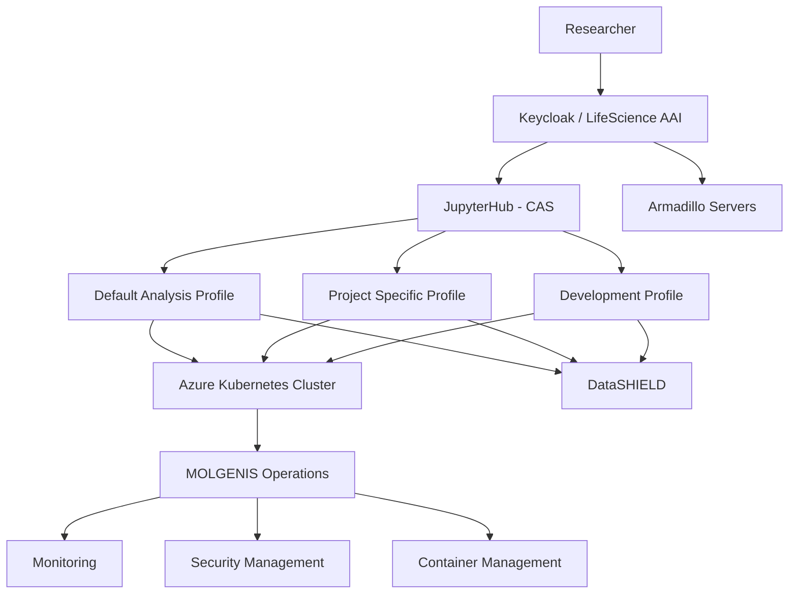

# Central Analysis Server

## Introduction

The Central Analysis Server (CAS) is the MOLGENIS-managed analytical platform used by multiple research projects to provide secure, scalable, and reproducible research workspaces.

The platform combines:

- Kubernetes-based infrastructure
- JupyterHub for workspace management
- Keycloak / LifeScience AAI authentication
- Project-specific Docker-based analysis profiles
- Azure cloud infrastructure
- DataSHIELD-compatible analysis environments

By centralizing these components, MOLGENIS provides a scalable analytical platform while ensuring reproducibility and secure access control.

---

# Architecture Overview



---

# Platform Components

## Azure Kubernetes Platform

The Central Analysis Server runs on a Kubernetes cluster hosted within Microsoft Azure.

Using Kubernetes provides:

- Container orchestration
- Horizontal scalability
- Isolation between projects
- Automated deployments
- Resource management
- High availability

This allows multiple projects to share the same infrastructure while keeping user environments isolated and reproducible.

---

## JupyterHub

JupyterHub acts as the central entry point for researchers.

Its responsibilities include:

- User authentication
- Workspace provisioning
- Profile selection
- Session management
- Resource allocation
- Automatic cleanup of idle sessions

Each researcher receives an isolated workspace running in its own Kubernetes pod.

---

## Authentication and Authorization

Authentication is handled using Keycloak and LifeScience AAI compatible identity providers.

This integration is critical because access rights must align with permissions assigned within project infrastructures such as Armadillo.

Authentication provides:

- Single Sign-On (SSO)
- Centralized user management
- Project-level authorization
- Role mapping
- Auditable access control

This ensures that only authorized researchers can access specific analytical environments and corresponding Armadillo resources.

---

# Deployments Using Helm

The platform is deployed using Helm, the package manager for Kubernetes.

Benefits of Helm include:

- Version-controlled deployments
- Repeatable infrastructure
- Simplified upgrades
- Environment-specific configuration
- Automated rollbacks

Example deployment:

```bash
helm repo add jupyterhub https://hub.jupyter.org/helm-chart/
helm repo update

helm upgrade --install analysis \
  jupyterhub/jupyterhub \
  --namespace analysis \
  --create-namespace \
  --values values.yaml
```

Official resources:

- https://github.com/jupyterhub/helm-chart
- https://z2jh.jupyter.org

---

# Example Configuration

A simplified example of a JupyterHub deployment:

```yaml
singleuser:
  image:
    name: datashield/rstudio-jupyter
    tag: latest

  profileList:
    - display_name: "Default Analysis Profile"
      description: "Standard DataSHIELD workspace"
      kubespawner_override:
        image: datashield/rstudio-jupyter:latest

    - display_name: "Project Profile"
      description: "Project-specific analysis environment"
      kubespawner_override:
        image: datashield/project-profile:1.0.0
```

Users can select a profile directly from JupyterHub when starting their workspace.

---

# Analysis Profiles

## Why Profiles Exist

Different projects often require:

- Different R versions
- Different DataSHIELD versions
- Project-specific R packages
- Python packages
- Custom analytical software

Allowing users to install software themselves can introduce inconsistencies and reduce reproducibility.

Instead, MOLGENIS distributes curated Docker images.

Benefits include:

- Reproducibility
- Validated package versions
- Easier support and troubleshooting
- Controlled updates
- Project-specific customization

Every researcher launching a specific profile receives exactly the same software environment.

---

## Example

A project might require:

```text
R 4.5.0
dsBaseClient 6.3.x
Specific Bioconductor packages
Project-specific analysis scripts
```

These dependencies are baked into a dedicated Docker image.

This ensures all project members work with identical software versions.

---

# Docker Images

The analysis environments are maintained as versioned Docker images.

Repository:

https://github.com/datashield/docker-jupyter-rstudio-base/tree/main/production

These images typically include:

- RStudio Server
- JupyterLab
- Python
- DataSHIELD clients
- Required R packages
- Project-specific extensions

Versioned releases ensure analyses remain reproducible over time.

---

# JupyterHub Profile Management

Profiles are exposed through the JupyterHub configuration.

Example:

```yaml
singleuser:
  profileList:
    - display_name: "Default DEV"
      kubespawner_override:
        image: datashield/rstudio-jupyter:dev

    - display_name: "DataSHIELD - Donkey-Lemon"
      kubespawner_override:
        image: datashield/rstudio-jupyter-donkey-lemon:1.1.0
```

This approach allows projects to maintain independent software stacks while sharing the same underlying infrastructure.

---

# Integration with Armadillo

A key requirement for DataSHIELD deployments is controlled access to Armadillo servers.

The authentication flow ensures that:

1. Researchers authenticate through Keycloak.
2. User roles and permissions are validated.
3. JupyterHub provisions the correct workspace.
4. Access is granted only to authorized Armadillo resources.

This alignment between authentication and authorization helps protect sensitive data resources while supporting federated analysis workflows.

---

# Operational Features

## Idle Session Cleanup

To optimize platform usage, idle sessions are automatically removed after a configurable timeout.

Benefits:

- Lower infrastructure costs
- Reduced cluster load
- Better resource utilization

Example:

```yaml
cull:
  enabled: true
  timeout: 3600
  every: 2400
```

---

## Monitoring

MOLGENIS continuously monitors:

- Kubernetes cluster health
- Pod status
- Resource consumption
- Application availability
- User activity trends

This enables proactive issue detection and operational reliability.

---

## Image Lifecycle Management

New Docker images can be introduced without affecting existing projects.

Projects can remain pinned to validated image versions while newer environments are tested independently.

This provides:

- Stable production environments
- Controlled upgrades
- Reduced risk during software updates

---

# Projects Using the Platform

The Central Analysis Server currently supports several research initiatives, including:

- ATHLETE
- EUCAN Connect
- EU Child Cohort Network
- DataSHIELD Playground

Each project can maintain its own authentication policies, software stack, and analysis workflows while sharing the same operational platform.

---

# Benefits for New Projects

Projects adopting the Central Analysis Server benefit from:

- Rapid onboarding
- Secure authentication integration
- Proven operational infrastructure
- Reproducible analysis environments
- Version-controlled software stacks
- Managed monitoring and maintenance
- Kubernetes scalability
- Access to MOLGENIS expertise

---

# Useful Links

## JupyterHub

- https://github.com/jupyterhub/helm-chart
- https://z2jh.jupyter.org

## Docker Profiles

- https://github.com/datashield/docker-jupyter-rstudio-base/tree/main/production

## Armadillo

- https://github.com/molgenis/molgenis-service-armadillo

## DataSHIELD

- https://www.datashield.org

## MOLGENIS

- https://www.molgenis.org

---

# Ask access to playgound setup

For testing the CAS you could ask access to our playground setup.
Please mail support@molgenis.org


# Additional Technical Documentation

For project developers and operators, additional documentation is available covering:

- Helm configuration
- Kubernetes deployments
- Docker image development
- Keycloak integration
- CI/CD pipelines
- Monitoring and observability
- Backup and disaster recovery procedures

Please contact the MOLGENIS infrastructure team for access to project-specific operational documentation.
support@molgenis.org
