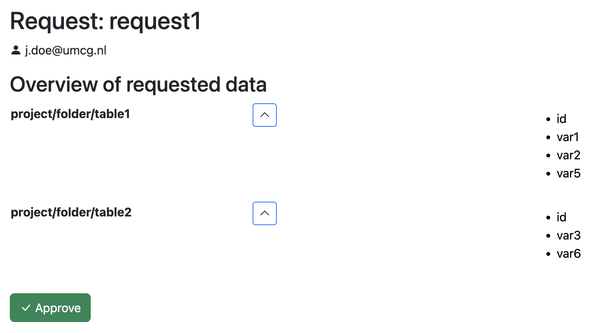

# Data request
<div style="border: 1px solid #005EC4; border-radius: 3px; width: 6em; padding-top: 3px;">
    <span style="background-color:#D4ECFF; padding: 5px 0px 2.5px 5px; border-radius: 3px 0px 0px 3px; ">
        <svg xmlns="http://www.w3.org/2000/svg" width="16" height="16" fill="#353535" class="bi bi-tag" viewBox="0 0 16 16">
            <path d="M6 4.5a1.5 1.5 0 1 1-3 0 1.5 1.5 0 0 1 3 0m-1 0a.5.5 0 1 0-1 0 .5.5 0 0 0 1 0"/>
            <path d="M2 1h4.586a1 1 0 0 1 .707.293l7 7a1 1 0 0 1 0 1.414l-4.586 4.586a1 1 0 0 1-1.414 0l-7-7A1 1 0 0 1 1 6.586V2a1 1 0 0 1 1-1m0 5.586 7 7L13.586 9l-7-7H2z"/>
        </svg>
    </span>
    <span style="margin: 0 0 0.5em 0; border-left: 3px solid #017FFD; padding: 5px 0 3px 0.5em">6.0.0</span>
</div>
To ease granting access to data in Molgenis Armadillo, a data request flow has been added. This flow can be accessed 
using a specifically formed  URL. To create this URL, you need: the user that requests the data, the table(s) data is
requested from and the variables of those tables. The tables and variables should then be base64 encoded. From that, 
the URL can be created. Here's an example:

The tables and variables should be in the following format:
```
project/folder/table1|id,var1,var2,var5;project/folder/table2|id,var3,var6
```
Then base64 encode these:
``` js
btoa("project/folder/table1|id,var1,var2,var5;project/folder/table2|id,var3,var6")
// results in:
"cHJvamVjdC9mb2xkZXIvdGFibGUxfGlkLHZhcjEsdmFyMix2YXI1O3Byb2plY3QvZm9sZGVyL3RhYmxlMnxpZCx2YXIzLHZhcjY="
```
The requestId is:
request1

Our armadillo URL is:
http://localhost:8080

Our user that requests access is: 
j.doe@umcg.nl

This results in the following url:
```
http://localhost:8080/#/r/request1/j.doe@umcg.nl/cHJvamVjdC9mb2xkZXIvdGFibGUxfGlkLHZhcjEsdmFyMix2YXI1O3Byb2plY3QvZm9sZGVyL3RhYmxlMnxpZCx2YXIzLHZhcjY=
```

Opening this will show the following page:


The only thing this page does is show what the request is according to the URL, tables, variables and users don't 
necessarily need to exist in order for them to show up. Upon pressing the "Approve" button, a project will be created 
with the request id, then a [subset]([armadillo_subsets.md](basic_usage/armadillo_subsets.md)) will be created for
the tables, only containing the requested variables. If any of the tables or variables don't exist, an errormessage 
will pop up. The user that requested the variables will be granted access to the project with the request id.