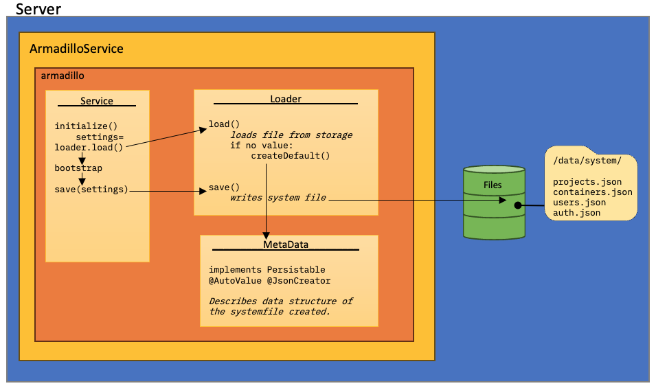

# System files in Armadillo
Because Armadillo doesn't have a database to store data in the application. This page is mainly aimed towards developers 
to explain how system files are loaded and kept. These files are kept in the `system` folder of the `data` folder of 
armadillo. There are four types of system files:
- `projects.json`: here the projects are stored with their user permissions
- `users.json`: here the users are stored with the projects they have permissions to
- `containers.json`: here the containers to connect with to do research on, are stored
- `auth.json`: here the authentication information for oidc connection is stored

/// caption
Although there are four different system files, they are created via roughly the same system. For all system files, 
there's a Service, a Loader and a MetaData class. The service initialises the process, creating a loader for the 
file, if the file exists, it will load the existing file, if not, it will create the file by instantiating the file 
structure defined by the MetaData class.
///

