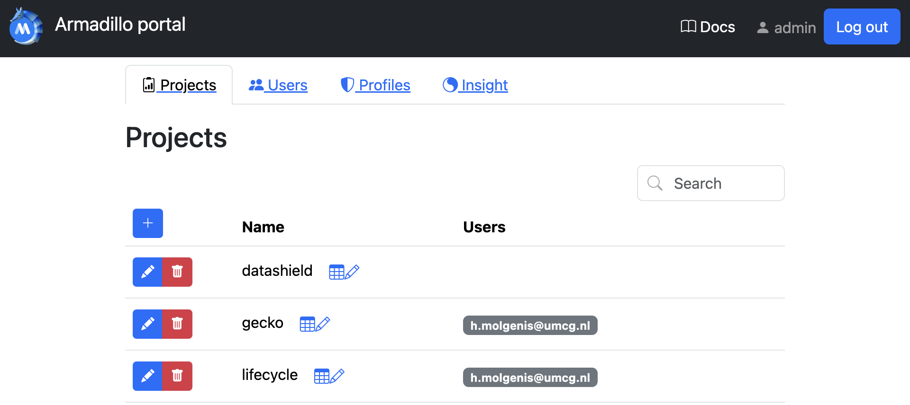
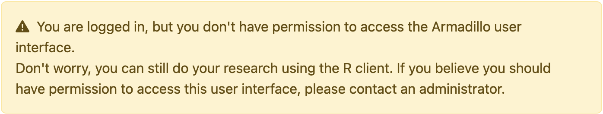
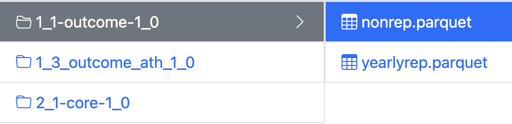

# Quick Start 
MOLGENIS Armadillo facilitates federated analysis using <a href="https://datashield.org/" target="_blank">DataSHIELD</a>. 
To learn more about DataSHIELD, visit their website or our <a href="/pages/basic_concepts/" >Basic Concepts page</a>.

## Playground server
If you have not yet installed Armadillo but would like to try it out, you can access our <a href="https://armadillo-playground.molgenis.net/" target="_blank">playground server</a>. Click on 'Institute Account' and 'Register' (located at the bottom). Once you have submitted your details, you will receive a confirmation email. Click on the link in the email, and you will then have access to the server. Return to the URL, and login via 'Institute Acccount'.

Below we provide a quick start for each type of user:

1. :material-file-table: [Data Manager](#data-manager)

2. :material-server: [System Operator](#system-operator)

3. :material-layers-search: [Researcher](#researcher)

4. :fontawesome-solid-laptop-code: [Developer](#developer)

## Data manager
Data management can be done in different ways: the Armadillo User Interface, the MolgenisArmadillo R client, or using DsUpload. 

### User interface
In the armadillo user interface, data managers can login and manage users, projects, workspaces and profiles. They can also see the logs (e.g. to understand errors that may have occurred or to monitor use). To get to know more about the UI, visit the [usage examples page](examples_usage.md).

{ width="1000" }

Please note that the user interface is only accessible by users with admin rights (i.e. usually data managers and not researchers) only. Users without admin permissions will get the following message:

{ width="700" }
/// caption
You are logged in but you don't have permission to access the Armadillo user interface.
///

### Armadillo R client
Data can also be managed using the MolgenisArmadillo R client. The following code block is an example of how to create a project
and upload data. 

```R
# Install and load the package
remotes::install.packages('MolgenisArmadillo')
library('MolgenisArmadillo')

# Login
armadillo.login("https://armadillo-playground.molgenis.net/")

# Load the iris dataset to upload as test
library(datasets)

# Create a project called "project"
armadillo.create_project("project")

# Upload the data in a folder called "folder"
armadillo.upload_table("project", "folder", iris)
```

Data is organised in projects. These projects can be compared to folders on the filesystem of your computer. 
Users can be granted access to specific projects. Within those projects, data are organised in folders.

{ width="500" }
/// caption
A typical project structure looks like this.
///


### DsUpload
[dsUpload](https://lifecycle-project.github.io/ds-upload/) is an R package that aids data managers in the data uploading
process. Data uploaded using this package has to fit the 
[dsDictionaries](ttps://github.com/lifecycle-project/ds-dictionaries/blob/master/README.md) format. 

## System Operator
System Operators are the people who install the software (Molgenis Armadillo) on the server. Installing is a quick and straightforward process, for full details please view the [Install Guide](../pages/install_management/index.md).

## Researcher
As a reseracher you will need to arrange access to each Armadillo (or Opal) server that holds the data you want to analyse. 
This guide shows you how to login, assuming you have been granted access to the server and the data. 

Research is conducted using R. To begin with you need install and load the following [packages](basic_concepts.md#datashield-packages-and-their-use):

```R
install.packages(c("DSI", "DSMolgenisArmadillo", "dsBaseClient"))
library(DSI)
library(DSMolgenisArmadillo)
library(dsBaseClient)
```
With these libraries, you can now login to Armadillo. Note - here we don't specify a profile so you will log in to the default profile. If there is a specific profile you want to connect to you can specify this with the argument e.g. `profile = donkey`.
```R
url <- "https://armadillo-playground.molgenis.net//"
token <- armadillo.get_token(url)
builder <- DSI::newDSLoginBuilder()

builder$append(
  server = "armadillo",
  url = url,
  token = token,
  driver = "ArmadilloDriver")
  
logindata <- builder$build()
conns <- DSI::datashield.login(logins = logindata)
```
To use the data, you first need to 'assign' it. This means to create a temporary copy on the server within your RSsesion. You can use the following code:
```R
datashield.assign.table(conns, "mtcars", "project/data/cars")
```
To see the data assigned in your workspace use:
```R
ds.ls()
```

If all of this succeeds, your access to Armadillo is setup correctly. 

For detailed information on how to use DataSHIELD as a researcher, please visit the [DataSHIELD Wiki](https://wiki.datashield.org/en/opmanag/private/researcher/intro)

For more extensive documentation Armadillo, please visit our documentation for [`DSMolgenisArmadillo`](https://molgenis.github.io/molgenis-r-datashield/).

## Developer
We encourage fellow developers to help us with new features or bugfixes in Armadillo, or help us with our R 
packages. To run Armadillo locally, first clone the git repository:
```shell
git clone https://github.com/molgenis/molgenis-service-armadillo.git
```
You first need to configure armadillo in the `application.yml`. To do that, you first will need to create this file. 
The easiest way to do that is by copying the 
[application.template.yml](https://github.com/molgenis/molgenis-service-armadillo/blob/master/application.template.yml)
and name it `application.yml`. 

If you are using IntelliJ, open the `ArmadilloServiceApplication` class (press shift twice and type the class name to go
there), and press the play button on the main function. You might have to first set the Java version (java 17). Armadillo 
will initialise up without oAuth configured, so you can login using the username `admin` and the password specified in 
`application.yml` (default: `admin`). 

For more information, see our [Developer guides](dev_guides.md) and [License](license.md). 